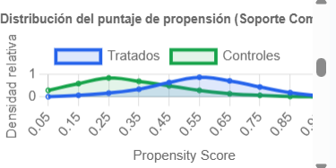

# ProyectoFinal_PoliticasPublicas

## Descripción del proyecto

Este repositorio centraliza el desarrollo metodológico y técnico para evaluar el impacto del Bono de Desarrollo Humano (BDH) en Ecuador mediante Propensity Score Matching (PSM). La meta es ofrecer un flujo reproducible y riguroso que utilice datos oficiales y permita estimar el efecto promedio del tratamiento sobre los beneficiarios.

## Estructura del repositorio

- `bitacora_ia.md`: registro de decisiones, avances y roles del equipo.
- `src/analysis/`: scripts, reportes y funciones para el análisis de PSM.
- `src/dashboard/`: interfaz web estática para visualizar resultados de PSM.
- `data/`: datos empíricos y futuros conjuntos de microdatos oficiales.

## Flujo de análisis

1. Cargar los microdatos correspondientes.
2. Definir claramente la variable de tratamiento BDH y los resultados de interés.
3. Estimar un modelo logit para el puntaje de propensión.
4. Verificar el soporte común entre los grupos tratado y de control.
5. Emparejar observaciones comparables y calcular el ATT.
6. Evaluar el balance de covariables antes y después del emparejamiento.
7. Visualizar resultados con el dashboard interactivo.

## 📊 Fuentes de Datos Originales y Metadatos
Para la ejecución de evaluaciones reales utilizando este flujo de Propensity Score Matching (PSM), se deben emplear los microdatos oficiales provistos por las instituciones gubernamentales del Ecuador:
* **Encuesta Nacional de Empleo, Desempleo y Subempleo (ENEMDU):** Instituto Nacional de Estadística y Censos (INEC). Contenido: Microdatos a nivel de hogar y personas, ingresos monetarios, escolaridad, características de la vivienda y condición de actividad. Acceso Oficial: https://www.ecuadorencifras.gob.ec/estadisticas-laborales-enemdu/
* **Registro de Social y Puntaje de Vulnerabilidad (Contextual):** Unidad del Registro Social / MIES.

## Datos disponibles

- `data/datos_reales_psm.xlsx`: datos empíricos para ensayar el flujo de PSM y la interfaz del dashboard.

## Uso recomendado

- Utilice `src/analysis/did_analysis.py` como base para estimar el puntaje de propensión, realizar el emparejamiento y evaluar el ATT.
- Consulte `src/analysis/psm_bdh_report.md` para la justificación metodológica y los supuestos de PSM.
- Abra `src/dashboard/index.html` para revisar visualizaciones de soporte común y comparación de ingresos antes y después del emparejamiento.

## Visualización: Gráfico de soporte común

Distribución del puntaje de propensión (soporte común) estimada a partir de los datos empíricos. La imagen fue generada desde la interfaz en `src/dashboard/index.html`.

## Metodología y rigor

El enfoque PSM aquí planteado busca emparejar beneficiarios del BDH con no beneficiarios que tengan probabilidades de tratamiento similares, condicionadas a covariables previas al programa. Esto reduce el sesgo por selección observada y permite una estimación más confiable del impacto del BDH sobre pobreza monetaria e ingresos.

Es esencial evitar variables post-tratamiento en el modelo de emparejamiento, garantizando que todas las covariables en el logit sean anteriores a la recepción del BDH.

## Instrucciones de despliegue

1. Abra `src/dashboard/index.html` en un navegador para visualizar el dashboard.
2. Ejecute el flujo en Python con sus datos en `data/`.
3. Revise el balance de covariables y el ATT en los resultados y verifique la estabilidad del soporte común.

## Referencias

- Rosenbaum, P. R., & Rubin, D. B. (1983). The central role of the propensity score in observational studies for causal effects.
- Becker, S. O., & Ichino, A. (2002). Estimation of average treatment effects based on propensity scores.
- Schady, N., & Rosero, J. (2008). Are cash transfers spent differently than other income? Hard evidence from Ecuador. Journal of Development Economics, 87(2), 246-253. DOI: https://doi.org/10.1016/j.jdeveco.2007.12.002
- Ponce, J., & Bedi, A. S. (2010). The impact of a cash transfer program on cognitive achievement: The Bono de Desarrollo Humano of Ecuador. Economics of Education Review, 29(1), 116-125. DOI: https://doi.org/10.1016/j.econedurev.2009.07.005
- Araujo, M. C., Bosch, M., & Schady, N. (2018). Can Cash Transfers Help Households Cope with Shocks? Evidence from Ecuador. World Bank Economic Review, 32(3), 609-626. DOI: https://doi.org/10.1093/wber/lhx009
- Instituto Nacional de Estadística y Censos (INEC). (2024). Reporte de Pobreza y Desigualdad por Ingresos - ENEMDU 2024. Quito, Ecuador.
